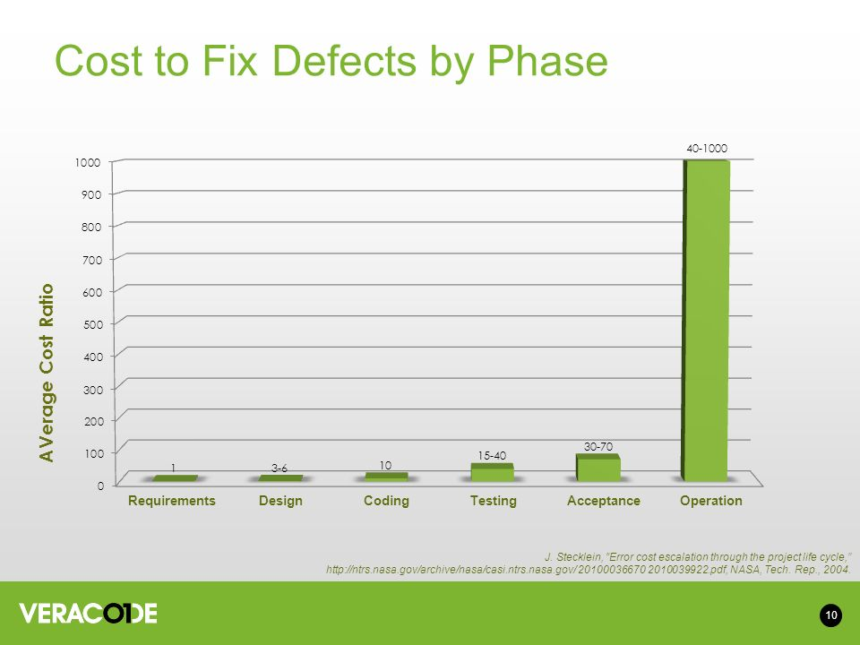
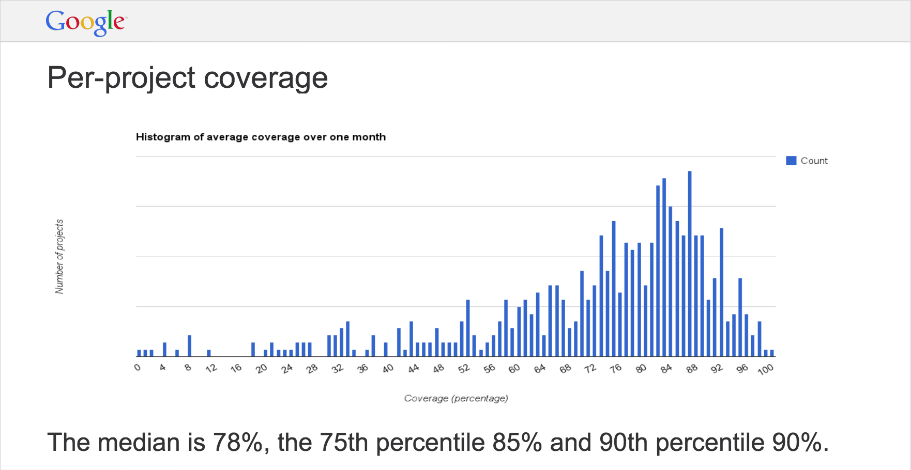

..  _cont:

Continuous Integration
======================

.. image:: _static/continuousintegrationcycle.png

Source : `Agile Test Automation is Incomplete Without Continuous Integration <https://kaizentesting.wordpress.com/2012/08/19/agile-test-automation-is-incomplete-without-continuous-integration/>`_

Continuous delivery is enabled by having automated tests that run in an automated test environment.  Upon every
code check-in to a repository, a test suite is run to ensure the new code does not break existing functionality
(does not 'regress').  Once the test suite passes the new code is allowed to be merged with existing code.

Pull Request Workflow
=====================

.. image:: _static/pull-request-flow.png
Source: `Pull Request Workflow <https://docs.rhodecode.com/RhodeCode-Enterprise/collaboration/pr-flow.html>`_

Virtually every new feature is developed in its own code branch.  Before starting to work on a new feature (or bug
fix), create a new local branch.  Once your development is complete and you have passed all local tests (you
will most likely want to run the regression test suite), issue a `pull request`.  This may also trigger
a code review.  If the pull request is approved, this branch is merged to the main branch (often called `master`).

Automated Testing
=================

Automated Testing is important for several reasons:

- Enables agile development techniques such as continuous integration
- Automation reduces testing effort over the long term
- Allows defects to be found earlier in the development cycle, when they are less costly

`Error Cost Escalation Through the Project Life Cycle <https://ntrs.nasa.gov/archive/nasa/casi.ntrs.nasa.gov/20100036670.pdf>`_

Agile also reduces Requirements Defects by implementing short cycle times.  While Agile does not address the initial
requirements specification, in reality these are often
`Leap-Of-Faith Assumptions <http://www.kimhartman.se/wp-content/uploads/2013/10/the-lean-startup-summary.pdf>`_,
and these hypotheses are tested quickly in the agile environment.

Code Coverage
-------------

Tests should be written to test features, but code coverage should be measured to find test holes.  In other words,
create tests to test the product, but don't 'cheat' and only write tests to get better code coverage.  When code
coverage is low, use the code coverage report to point to areas of your code that you missed.  Then think about the
product features that are implemented in those lines of code, and test those features.

While there are more exotic techniques available, simple line code coverage is generally good enough.

`Code coverage should be at least 80%, with a goal of 85% <https://docs.google.com/presentation/d/1god5fDDd1aP6PwhPodOnAZSPpD80lqYDrHhuhyD7Tvg/edit#slide=id.g3f5c82004_99_135>`_.
While more coverage is better, often the `ROI greatly diminishes after ~85% <https://image.slidesharecdn.com/ccpragmatic-130603121851-phpapp02/95/pragmatic-code-coverage-27-638.jpg>`_.

`Google code coverage <https://docs.google.com/presentation/d/1god5fDDd1aP6PwhPodOnAZSPpD80lqYDrHhuhyD7Tvg/edit#slide=id.g3f5c82004_99_135>`_

