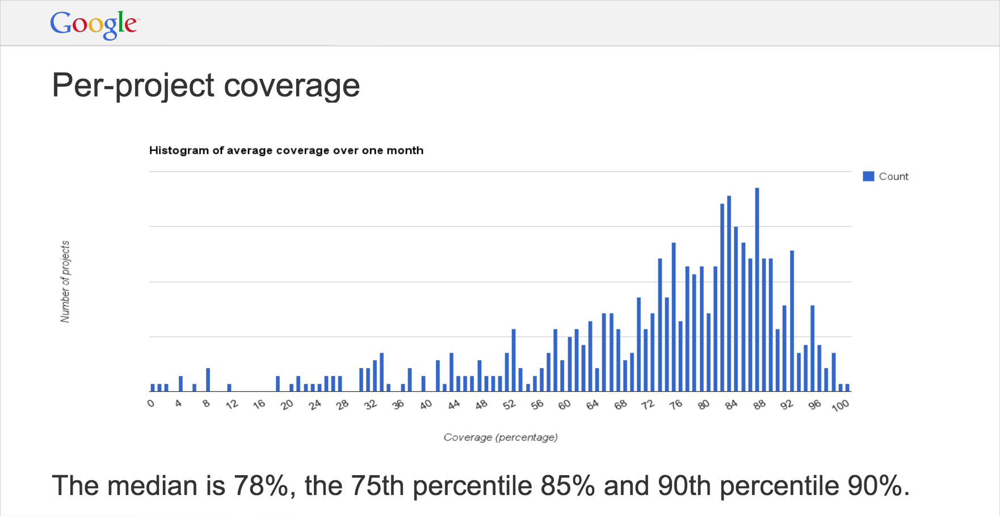

..  _testing:

Testing
=======

Automated Testing
-----------------

Automated Testing is important for several reasons:

- Enables agile development techniques such as continuous integration
- Automation reduces testing effort over the long term
- Allows defects to be found earlier in the development cycle, when they are less costly

.. image:: _static/cost_to_fix_defects_by_phase.jpg
`Error Cost Escalation Through the Project Life Cycle <https://ntrs.nasa.gov/archive/nasa/casi.ntrs.nasa.gov/20100036670.pdf>`_

Agile also reduces Requirements Defects by implementing short cycle times.  While Agile does not address the initial
requirements specification, in reality these are often
`Leap-Of-Faith Assumptions <http://www.kimhartman.se/wp-content/uploads/2013/10/the-lean-startup-summary.pdf>`_,
and these hypotheses are tested quickly in the agile environment.

Frameworks
----------

The `pytest <https://docs.pytest.org>`_ framework is used in Python.  pytest is a full featured test infrastructure.
This works for unit tests as well as system tests.

Testing for Expected Results
----------------------------

Each automated test will check for expected results.  It is insufficient to merely ensure that the software doesn't
crash.

Design for Testability
----------------------

Code may need to be designed for testability.  This can be for controllability and/or observability.
Controllability can be used to force systemic situations that are difficult to realize on real systems, for
example the number of processors or a lack of a network connection.  An example of observability could be writing
out a machine readable version of plotted values, since graphical output is usually harder to compare (although
some graphical comparisons can also be beneficial).

Testing Levels
--------------

|

+---------------------+--------------------------------------------------------------------------------------------------------------------------------------------------------------------------------------------------------------------------------------+
| Level               | Summary                                                                                                                                                                                                                              |
+=====================+======================================================================================================================================================================================================================================+
| Unit Testing        | A level of the software testing process where individual units/components of a software/system are tested. The purpose is to validate that each unit of the software performs as designed.                                           |
+---------------------+--------------------------------------------------------------------------------------------------------------------------------------------------------------------------------------------------------------------------------------+
| Integration Testing | A level of the software testing process where individual units are combined and tested as a group. The purpose of this level of testing is to expose faults in the interaction between integrated units.                             |
+---------------------+--------------------------------------------------------------------------------------------------------------------------------------------------------------------------------------------------------------------------------------+
| System Testing      | A level of the software testing process where a complete, integrated system/software is tested. The purpose of this test is to evaluate the system’s compliance with the specified requirements.                                     |
+---------------------+--------------------------------------------------------------------------------------------------------------------------------------------------------------------------------------------------------------------------------------+
| Acceptance Testing  | A level of the software testing process where a system is tested for acceptability. The purpose of this test is to evaluate the system’s compliance with the business requirements and assess whether it is acceptable for delivery. |
+---------------------+--------------------------------------------------------------------------------------------------------------------------------------------------------------------------------------------------------------------------------------+
`Software Testing Levels <http://softwaretestingfundamentals.com/software-testing-levels/>`_

Code Coverage
-------------

Tests should be written to test features, but code coverage should be measured to find test holes.  In other words,
create tests to test the product, but don't 'cheat' and only write tests to get better code coverage.  When code
coverage is low, use the code coverage report to point to areas of your code that you missed.  Then think about the
product features that are implemented in those lines of code, and test those features.

While there are more exotic techniques available, simple line code coverage is generally good enough.

`Code coverage should be at least 80%, with a goal of 85% <https://docs.google.com/presentation/d/1god5fDDd1aP6PwhPodOnAZSPpD80lqYDrHhuhyD7Tvg/edit#slide=id.g3f5c82004_99_135>`_.
While more coverage is better, often the `ROI greatly diminishes after ~85% <https://image.slidesharecdn.com/ccpragmatic-130603121851-phpapp02/95/pragmatic-code-coverage-27-638.jpg>`_.

`Google code coverage <https://docs.google.com/presentation/d/1god5fDDd1aP6PwhPodOnAZSPpD80lqYDrHhuhyD7Tvg/edit#slide=id.g3f5c82004_99_135>`_

